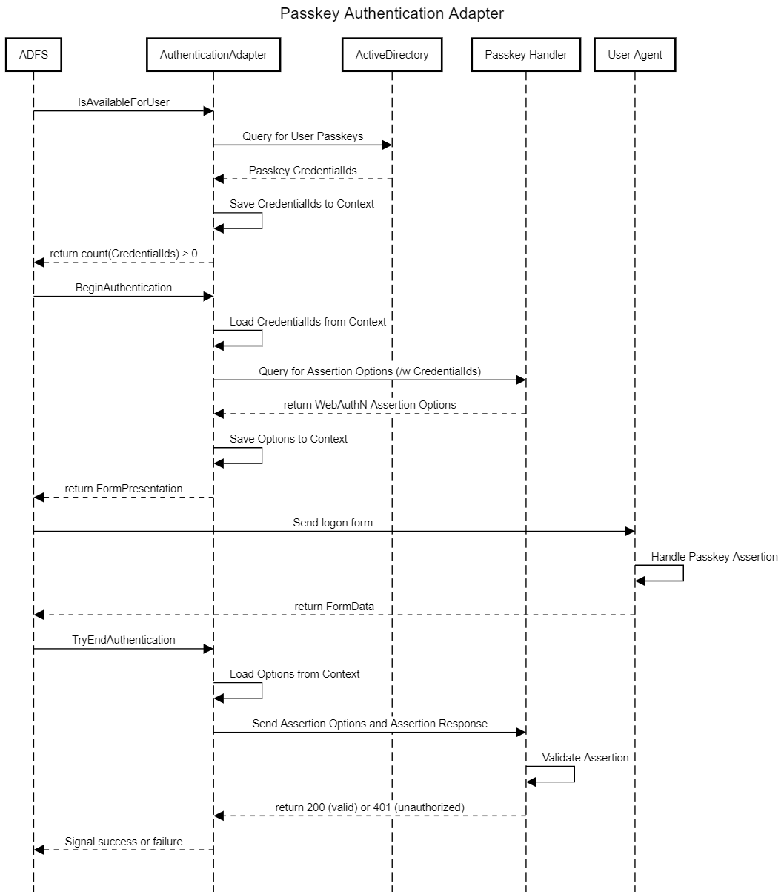

# About this Solution

This solution provides two different ways to enable passkey authentication within an SSO structure that does not directly support it (namely Microsoft ADFS).

## Prerequisites

You have an ldap containing the passkey information.
The information is saved in [ldap attributes](./docs/LdapSchema.md) as proposed by @aseigler [on Github](https://github.com/passwordless-lib/fido2-net-lib/blob/ActiveDirectory/fido2-net-lib/ActiveDirectoryStore.cs).

## MFA with FIDO2 Passkey in ADFS

The extension interface of ADFS is rather limited and does not allow for easy integration of passkey authentication.
It's however possible to use a local (as in localhost on the ADFS server) webserver to handle the passkey authentication in a modern and more flexible way.

### Architecture and description

ADFS loads an `IAuthencitationAdapter` that is able to detect if a user has Passkeys available via an ActiveDirectory query.  
Then ADFS will make an http request to passkey handler (a localhost service), that will create the assertion options and specifically the challenge for FIDO2 Passkey authentication.
The assertion options are embedded into the adfs context AND html output and sent to the user agent.

The user agent will process the passkey authentication flow and create an assertion response, that is sent back to the ADFS.
The assertion options from the ADFS context object as well as the assertion response from the user agent are sent back to the aforementioned passkey handler and processed there.
If the assertion is valid the handler will answer with HTTP 200 (OK) and the `IAuthenticationAdapter` will signal successfull MFA logon to ADFS.



### Deployment

There's three things that need to be deployed:

1. JGUZDV.ADFS.PasskeyAuthenticationAdapter (GAC)
2. JGUZDV.ADFS.PasskeyHandler (local Windows Service)
3. VC++ Runtime

If you wan't to build it yourself, you'll need msbuild, since the PasskeyHandler uses COM.
The commands are:

```cmd
PasskeyAuthenticationAdapter> dotnet publish -c Release
PasskeyHandler> msbuild.exe -t:publish -p:Configuration=Release
```

Copy the files over to the ADFS servers - I'll assume C:\Passkey\Adapter and .\Handler but you might want to use Program Files.

#### PasskeyAuthenticationAdapter

To deploy to the GAC a few lines of powershell will be sufficient:
```powershell
$deployPath = "C:\Passkey\Adapter\"

[System.Reflection.Assembly]::Load("System.EnterpriseServices, Version=4.0.0.0, Culture=neutral, PublicKeyToken=b03f5f7f11d50a3a")
$publish = New-Object System.EnterpriseServices.Internal.Publish

Stop-Service adfssrv

$items = Get-ChildItem $binaryPath -Recurse -Include "JGUZDV.*.dll";
$items | % { $publish.GacInstall($_.FullName) };

Start-Service adfssrv
```

Create a config file `C:\Passkey\Adapter\AdapterConfig.json`:

```json
{
    "PasskeyHandlerUrl": "http://localhost:5000",

    "LdapServer": "ldap.mydomain.com",
    "SearchBaseDN": "OU=Users,DC=MyDomain,DC=com"
}
```

Register the module in ADFS:

```powershell
Register-AdfsAuthenticationProvider -Name "FIDO2Passkey" `
    -TypeName "JGUZDV.ADFS.PasskeyAuthenticationAdapter.AuthenticationAdapter, JGUZDV.ADFS.PasskeyAuthenticationAdapter, Version=1.0.0.0, Culture=neutral, PublicKeyToken=7c2a44869db3d938" `
    -ConfigurationFilePath "C:\Passkey\AdapterConfig.json"
```

#### PasskeyHandler

Modify the config file `C:\Passkey\Handler\appsettings.json`

```json
{
  // ...

  "Fido2": {
    "ServerDomain": "mydomain.com",
    "ServerName": "A server name",
    "Origins": [ "https://adfs.mydomain.de" ],

    "ChallengeSize": 32
  },

  "ActiveDirectory": {
    "Server": "ldap.mydomain.com",
    "BaseOu": "OU=Users,DC=MyDomain,DC=com"
  }
}
```

We'll register it as windows service, so it gets automatically started with the machine

```powershell
New-Service -Name ADFSPasskeyHandler -BinaryPathName "C:\Passkey\Handler\JGUZDV.ADFS.PasskeyHandler.exe"
Start-Service -Name ADFSPasskeyHandler
```


## Passkey as primary authentication bypassing MFA

Since ADFS does not allow primary authentication methods in any useful way, we are moving the passkey authentication into an SAML2 IDP, that'll have it's own webpage and enable us to 
make the ADFS think, that the authentication was a proper MFA authentication, allowing anyone authenticating with a passkey to use it as primary two-factor authentication.
ADFS will use the IDP as ClaimProviderTrust and we're injecting all claims neccessary to make ADFS think it's already been auhtenticated with multiple factors.
